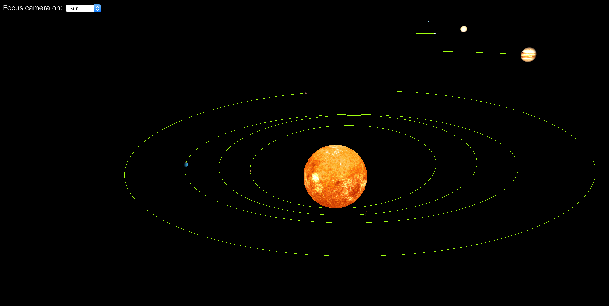

# MyUniverse

Solar system simulator in javascript, using the ThreeJS library. This is coded using a OOP paradigm. This experiment is still in developpement. Hope you enjoy it !

## Preview

## Features included, for the moment.

- Moving around, zooming
- Changing your point of view
- Planets trajectories

## Features to come !

- Adding satellites to planets
- Statistics of each planet
- Different types of planets (Rock, Gas, Rings ...)
- Multiple suns
- Collisions
- LeapMotion support !
- Comets
- And more ....